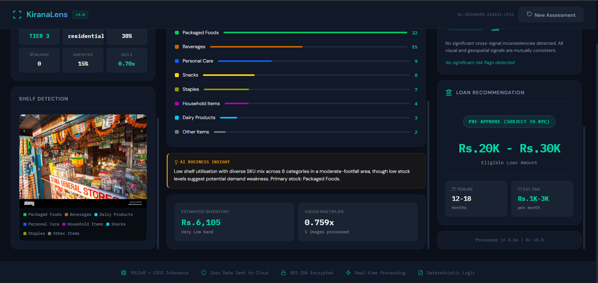
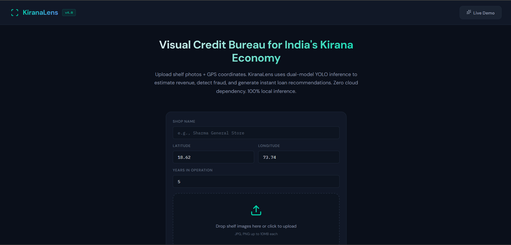
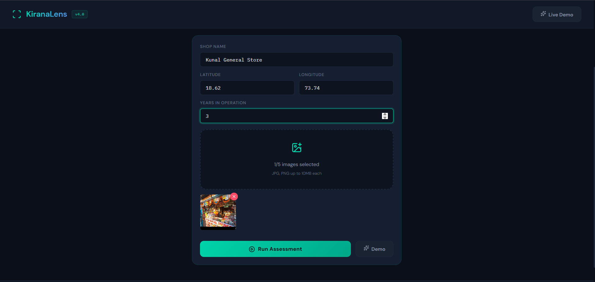
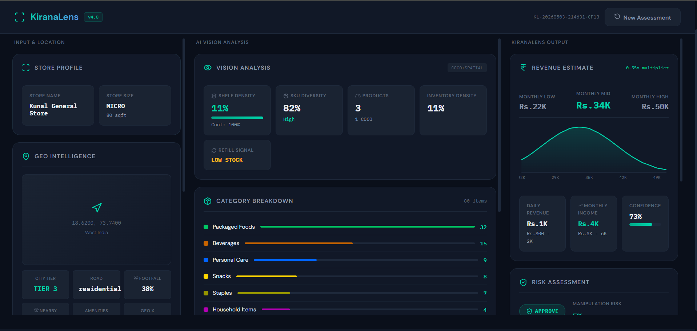
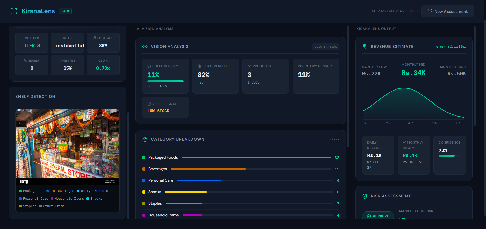
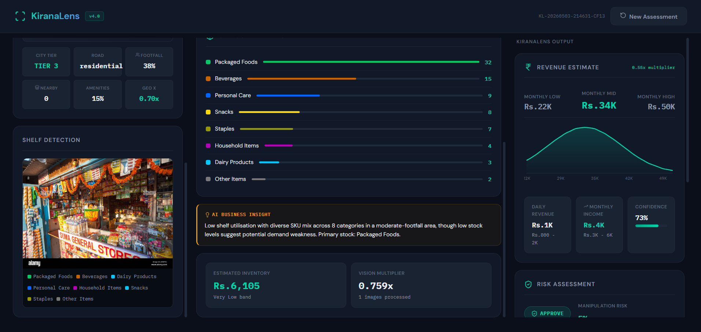

> [!CAUTION]
> ## 🚨🚨 **MANDATORY REQUIREMENT TO RUN THIS PROJECT** 🚨🚨  
> ### 🔑 **Get your Hugging Face Token from here:(For FREE)**  
> 👉 **<a href="https://huggingface.co/settings/tokens" target="_blank">https://huggingface.co/settings/tokens</a>**  
>
> ⚠️ This project **WILL NOT WORK** without a valid Hugging Face access token.  
>
> #### 📌 Instructions:
> - Generate your token from the link above  
> - Add it to your `.env` file after cloning the repository  
> - Example:
>   ```
>   HF_TOKEN=your_token_here
>   ```

---

<h1 align="center">🛒 KiranaLens</h1>
<p align="center">
  <strong>Visual Credit Bureau for India's Kirana Economy</strong>
</p>

<p align="center">
  CRP TenzorX 2026 · Poonawalla Fincorp National AI Hackathon · <b>Top 150 Teams</b>
</p>

---

<p align="center">
  <a href="https://python.org">
    
  </a>
  <a href="https://fastapi.tiangolo.com">
    
  </a>
  <a href="https://reactjs.org">
    
  </a>
  <a href="https://ultralytics.com">
    
  </a>
  <a href="https://huggingface.co">
    
  </a>
</p>

<p align="center">
  
  
</p>

---

<p align="center">
  📸 3 photographs · 📍 GPS coordinates · ⚡ JUST 20 seconds  
  <br/>
  💰 Unlocking India's ₹87 lakh crore kirana credit gap
</p>
---

## 📸 Live Demo — Input → Output

> *Upload shop photos, get a complete underwriting assessment. Here's what it looks like:*

<br/>

<div align="center">

### Assessment Workflow

| Step | Screenshot |
|:----:|:----------:|
| **1. Upload Shop Images** |  |
| **2. Enter GPS Location** |  |
| **3. Processing Pipeline** |  |
| **4. Revenue Estimate Output** |  |
| **5. Signal Dashboard** |  |
| **6. Fraud Analysis & Recommendation** |  |

</div>

<br/>

---

## 🎯 What is KiranaLens?

KiranaLens is an **AI-powered remote cash flow underwriting engine** that assesses the creditworthiness of India's 13 million kirana stores using only:

- 📷 **3–5 photographs** of the shop (shelves, counter, storefront)
- 📍 **GPS coordinates** of the store location

**No transaction history. No GST records. No bank statements. No field visits.**

### The Problem It Solves

```
India has 13 million kirana stores
They create ₹87 lakh crore in credit demand
Less than 12% gets formal financing

WHY?
├── Stores operate in cash → no digital trail
├── No bookkeeping → no financial statements  
├── No credit bureau file → no standard underwriting
└── Field visits cost ₹800–1,500 each → not scalable

KiranaLens reads the physical store as a financial document.
```

---

## ⚡ Quickstart

### Prerequisites

- Python 3.11+
- Node.js 18+
- Free HuggingFace account (2 minutes, no credit card)

### Step 1 — Get Your Free HuggingFace Token

```
1. Go to: https://huggingface.co/settings/tokens
2. Sign up (free, no credit card required)
3. Click "New token" → name it "kiranalens" → Read access → Create
4. Copy the token (starts with hf_)
```

### Step 2 — Clone & Configure

```bash
git clone https://github.com/YOUR_USERNAME/kiranalens.git
cd kiranalens

# Copy environment template
cp .env.example .env

# Open .env and paste your token:
# HF_TOKEN=hf_your_token_here
```

### Step 3 — Backend Setup

```bash
cd backend
pip install -r requirements.txt

# Start the server
uvicorn app.main:app --reload --port 8000
```

Wait for these messages:
```
✅ YOLOv8 model loaded (downloads ~22MB on first run — normal)
✅ Backend ready — all systems go
```

### Step 4 — Frontend Setup

```bash
# Open a new terminal
cd frontend
npm install
npm start
```

Open **http://localhost:3000**

### Step 5 — Try It

- Click **"Try Demo"** for an instant result without uploading images
- Or go to `/assess`, upload 3+ shop photos, enter GPS → get your assessment

### 💰 Total Cost: ₹0

The entire stack is free. You only need a free HuggingFace account.

---

## 🧠 How It Works — The 7-Layer Pipeline

```
┌─────────────────────────────────────────────────────────────────┐
│                    INPUT LAYER                                   │
│         3–5 Shop Images  +  GPS Coordinates                     │
│         + Optional: Shop Name, Years in Operation               │
└──────────────────────────┬──────────────────────────────────────┘
                           │
          ┌────────────────▼─────────────────┐
          │     IMAGE QUALITY VALIDATION      │
          │  Blur · Brightness · Contrast     │
          │  Quality Score per image [0–1]    │
          └────────────┬─────────────────────┘
                       │
       ┌───────────────▼────────────────┐    ┌─────────────────────────────┐
       │   VISION INTELLIGENCE LAYER    │    │   GEO-SPATIAL LAYER          │
       │   Dual-Model YOLOv8 Pipeline   │    │   OSMnx + Overpy (Free OSM)  │
       │                                │    │                               │
       │  Primary: shelf-specialist     │    │  • City Tier Detection        │
       │  Fallback: yolov8n.pt (COCO)   │    │  • Road Type Score            │
       │                                │    │  • Amenity Intelligence       │
       │  Features extracted:           │    │  • Competition Density        │
       │  • SDI (Shelf Density Index)   │    │  • Footfall Proxy Index       │
       │  • SKU Diversity Score         │    │  • India Region Mapping       │
       │  • Inventory Density           │    │                               │
       │  • Refill Signal               │    │  → GeoMultiplier [0.50–1.60]  │
       │  • Visual Organisation         │    │  → india_region detected      │
       │  • Store Size Proxy            │    └──────────────┬────────────────┘
       │                                │                   │
       │  → VisionMultiplier [0.60–1.60]│                   │
       └───────────────┬────────────────┘                   │
                       └──────────────┬─────────────────────┘
                                      │
          ┌───────────────────────────▼──────────────────────────┐
          │         OPERATIONAL STABILITY SIGNAL  ★ NEW          │
          │                                                       │
          │  Answers: "Is this genuine demand or staged?"         │
          │                                                       │
          │  Inputs: SDI variance + refill pattern +             │
          │          visual organisation + years_in_operation     │
          │                                                       │
          │  → stability_score [0–1]                             │
          │  → StabilityFactor [0.85–1.15]                       │
          │  → possible_initial_stocking flag                    │
          └───────────────────────────┬──────────────────────────┘
                                      │
          ┌───────────────────────────▼──────────────────────────┐
          │       REGIONAL DEMAND ALIGNMENT SIGNAL  ★ NEW        │
          │                                                       │
          │  Answers: "Does inventory match what locals buy?"     │
          │                                                       │
          │  GPS → State → Region (N/S/E/W/Central India)        │
          │  NielsenIQ-informed FMCG demand profiles per region  │
          │  Vision categories matched against regional profile   │
          │                                                       │
          │  → alignment_score [0–1]                             │
          │  → DemandAlignmentFactor [0.90–1.10]                 │
          └───────────────────────────┬──────────────────────────┘
                                      │
          ┌───────────────────────────▼──────────────────────────┐
          │              ECONOMIC MODEL ENGINE                    │
          │                                                       │
          │  Sales = BaseRate                                     │
          │        × VisionMultiplier    [0.60 – 1.60]           │
          │        × GeoMultiplier       [0.50 – 1.60]           │
          │        × CompAdj             [0.80 – 1.15]           │
          │        × StabilityFactor     [0.85 – 1.15]           │
          │        × DemandAlignFactor   [0.90 – 1.10]           │
          │                                                       │
          │  Base rates: 20-cell lookup table                     │
          │  Anchored to NSS/RBI/NABARD 2022 survey data         │
          │  Combined multiplier: hard-capped at 1.40×           │
          └───────────────────────────┬──────────────────────────┘
                                      │
          ┌───────────────────────────▼──────────────────────────┐
          │           FRAUD & RISK DETECTION ENGINE               │
          │                                                       │
          │  Layer 1: Deterministic Rules (fires first)          │
          │    IF SDI > 0.75 AND alignment < 0.35                │
          │       → INVENTORY_DEMAND_MISMATCH                    │
          │    IF SDI > 0.88 AND stability < 0.45 AND STAGED     │
          │       → STAGED_DISPLAY (HIGH)                        │
          │    IF alignment > 0.70 AND footfall < 0.30           │
          │       → GEO_DEMAND_INCONSISTENCY                     │
          │    IF age < 1yr AND SDI > 0.85                       │
          │       → INITIAL_STOCKING_FRAUD (HIGH)                │
          │                                                       │
          │  Layer 2: Llama 3.2 Vision (HF Inference API)       │
          │    Adversarial cross-signal consistency review        │
          │    5 mandatory consistency checks                     │
          │    Structured JSON fraud report output                │
          └───────────────────────────┬──────────────────────────┘
                                      │
          ┌───────────────────────────▼──────────────────────────┐
          │                 STRUCTURED OUTPUT                     │
          │                                                       │
          │  • Daily Sales Range: ₹X,XXX – ₹XX,XXX              │
          │  • Monthly Revenue: ₹X,XX,XXX – ₹X,XX,XXX           │
          │  • Monthly Net Income: ₹XX,XXX – ₹XX,XXX            │
          │  • Confidence Score: 0.XX                            │
          │  • Stability Grade: HIGH / MEDIUM / LOW              │
          │  • Demand Alignment: STRONG / MODERATE / WEAK        │
          │  • Risk Flags: [] (or detailed flag objects)         │
          │  • Recommendation: APPROVE / VERIFY / REJECT         │
          │  • Human-readable Report (AI-generated)              │
          └──────────────────────────────────────────────────────┘
```

---

## 📊 The 6-Factor Formula

Every rupee of the estimate is fully traceable. No black box.

```
Daily Sales = BaseRate × VisionMult × GeoMult × CompAdj × StabilityFactor × DemandAlignFactor
```

| Factor | Range | Source | What it captures |
|--------|-------|--------|-----------------|
| **Base Rate** | ₹1,200–₹45,000/day | NSS/RBI/NABARD 2022 data | Median sales for city tier × store size |
| **Vision Multiplier** | [0.60 – 1.60] | YOLOv8 local inference | Shelf density, SKU diversity, inventory density, refill pattern |
| **Geo Multiplier** | [0.50 – 1.60] | OSMnx + Overpy (free OSM) | Road type, nearby amenities, catchment density, footfall proxy |
| **Competition Adj** | [0.80 – 1.15] | OSM shop query | 4–8 nearby stores = demand validated. 16+ = margin pressure |
| **Stability Factor** | [0.85 – 1.15] | Novel Signal v3.0 ⭐ | Genuine demand vs staged inventory detection |
| **Demand Alignment** | [0.90 – 1.10] | Novel Signal v3.0 ⭐ | Regional FMCG consumption pattern alignment |

**Worked Example:**
```
₹9,000 (Tier-2, Small Store, Pune)
  × 1.12 (Vision: SDI=0.74, 9 categories, NORMAL refill)
  × 1.08 (Geo: secondary road, schools + transport nearby)
  × 1.10 (Competition: 6 stores within 500m — sweet spot)
  × 1.09 (Stability: HIGH grade, 6 years operating)
  × 1.05 (Demand: 76% West India alignment — STRONG)
= 1.53× raw → clamped to 1.40× → ₹12,600/day
→ ₹3,27,600/month revenue → ₹52,416/month net income
```

---

## 🆕 Two Novel Signals — Never Done Before in Credit Underwriting

### ⭐ Signal 1: Operational Stability Score

Answers: *"Is this store reflecting genuine, consistent demand — or temporary staged inventory?"*

```python
stability_score = (
    sdi_level_score      × 0.25 +   # Well-stocked [0.50–0.85] = peak
    consistency_score    × 0.30 +   # Low SDI variance across images = real store
    refill_score         × 0.25 +   # NORMAL gaps = products are selling
    organisation_score   × 0.20     # Very uniform = staged; natural = authentic
) + years_bonus                     # +0.15 for 5yr+ with active turnover

# → stability_factor ∈ [0.85, 1.15]
# → Flag: possible_initial_stocking (new store + very full shelves)
```

**Why this matters:** A fraudster can fill shelves for one day. They cannot fake 5 years of natural shelf-gap patterns, consistent SDI variance, and moderate visual organisation across 5 images taken from different angles.

### ⭐ Signal 2: Regional Demand Alignment Score

Answers: *"Does this store stock what people in this geography actually buy?"*

```
GPS Coordinates
    ↓ Nominatim reverse geocoding
State Name → Region (North/South/East/West/Central India)
    ↓ NielsenIQ-informed FMCG demand profile lookup
Expected categories: [atta, biscuits, dairy, namkeen, mustard_oil, tea]
    ↓ Match against YOLOv8-detected categories
alignment_score = (primary_matches / |primary|) × 0.70
                + (secondary_matches / |secondary|) × 0.30
    ↓
demand_alignment_factor ∈ [0.90, 1.10]
```

| Region | Primary Demand Profile |
|--------|----------------------|
| 🟦 **North India** | Atta · Biscuits · Dairy · Namkeen · Mustard oil · Tea |
| 🟩 **South India** | Rice · Coconut oil · Coffee · Spices · Idli/Dosa mix · Hair oil |
| 🟨 **East India** | Rice · Mustard oil · Tea · Fish products · Dairy · Biscuits |
| 🟥 **West India** | Namkeen · Cold beverages · Packaged food · Groundnut oil · Tea |
| 🟪 **Central India** | Atta · Edible oils · Biscuits · Namkeen · Spices · Tea |

---

## 🛡️ Fraud Detection — 5 Flags, 2 Layers

### Layer 1: Deterministic Rules (fires before LLM)

| Flag | Trigger Condition | Severity | Logic |
|------|-----------------|----------|-------|
| `INVENTORY_DEMAND_MISMATCH` | SDI > 0.75 AND alignment < 0.35 | MEDIUM | Well-stocked with wrong products for the region |
| `STAGED_DISPLAY` | SDI > 0.88 AND stability < 0.45 AND refill=STAGED | HIGH | All three staging signals agree simultaneously |
| `GEO_DEMAND_INCONSISTENCY` | alignment > 0.70 AND footfall < 0.30 | MEDIUM | Claims regional demand but location has no traffic |
| `INITIAL_STOCKING_FRAUD` | age < 1yr AND SDI > 0.85 | HIGH | New store bulk-stocked to inflate creditworthiness |
| `ECONOMIC_IMPLAUSIBILITY` | combined_multiplier > 1.40 | HIGH | Formula output hard-capped — economic reality check |

### Layer 2: Llama 3.2 Vision Reasoning (HF Inference API)

The LLM is framed as a **skeptical underwriter reviewing a suspicious application** — not as a helpful assistant. It runs 5 mandatory consistency checks across all signals and produces structured JSON output.

> **Core anti-fraud principle:** *"No single signal is trusted in isolation. Fraud requires simultaneous gaming of vision, geo, stability, and regional signals — each independently computed, each verified against the others."*

---

## 🔧 Technical Architecture

### Backend Services

```
backend/
├── app/
│   ├── main.py                    ← FastAPI app + startup + CORS
│   ├── routes/
│   │   └── assessment.py          ← POST /assess · GET /demo · GET /health
│   ├── services/
│   │   ├── vision_service.py      ← YOLOv8 dual-model pipeline
│   │   ├── geo_service.py         ← OSMnx + Overpy + Nominatim
│   │   ├── stability_service.py   ← Operational Stability Signal ⭐
│   │   ├── regional_demand_service.py  ← Regional Demand Alignment ⭐
│   │   ├── economic_engine.py     ← 6-factor formula + confidence
│   │   └── hf_service.py          ← Llama 3.2 via HF Inference API
│   ├── models/
│   │   └── schemas.py             ← All Pydantic v2 data models
│   └── utils/
│       └── image_utils.py         ← Preprocessing helpers
└── tests/
    ├── test_vision.py
    ├── test_geo.py
    ├── test_stability.py
    ├── test_regional_demand.py
    └── test_economic.py
```

### Frontend Pages

```
frontend/src/
├── pages/
│   ├── Landing.tsx       ← Hero + stats + CTAs
│   ├── Assess.tsx        ← 3-step upload flow + progress tracker
│   └── Results.tsx       ← Full assessment dashboard (8 sections)
├── components/           ← Reusable UI components
├── utils/
│   └── api.ts            ← Typed API client
└── types/
    └── assessment.ts     ← Full TypeScript types for API response
```

### API Endpoints

| Method | Endpoint | Description | Auth |
|--------|---------|-------------|------|
| `GET` | `/api/v1/health` | System status + model loaded check | None |
| `GET` | `/api/v1/demo` | Instant demo result (no images needed) | None |
| `POST` | `/api/v1/assess` | Full assessment pipeline | None |

### POST `/api/v1/assess` — Request

```
Content-Type: multipart/form-data

images         File[]   3–5 JPEG/PNG images (max 8MB each)
lat            float    GPS latitude (India: 6.0–38.0)
lng            float    GPS longitude (India: 68.0–98.0)
shop_name      string   Optional store name
years_in_operation  int  Optional years operating (0 = unknown)
```

### POST `/api/v1/assess` — Response

```json
{
  "assessment_id": "KL-20260429-142307-A3F2",
  "timestamp_utc": "2026-04-29T14:23:07Z",
  "status": "COMPLETE",
  "inputs": {
    "image_count": 4,
    "gps": { "lat": 18.52, "lng": 73.86 },
    "shop_name": "Sharma General Store",
    "years_in_operation": 6
  },
  "vision_features": {
    "sdi": 0.74,
    "sdi_confidence": 0.82,
    "sdi_variance": 0.04,
    "sku_diversity_count": 9,
    "detected_categories": ["beverages_bottles", "packaged_snacks", "bulk_staples"],
    "inventory_density_score": 0.67,
    "refill_signal": "NORMAL",
    "visual_organisation_score": 0.61,
    "store_size_proxy": "SMALL",
    "total_products_detected": 94,
    "image_quality_scores": [0.82, 0.79, 0.85, 0.88],
    "overall_image_quality": 0.835,
    "vision_multiplier": 1.12
  },
  "geo_features": {
    "city_tier": "TIER_2",
    "india_region": "west_india",
    "road_type": "secondary",
    "road_type_score": 0.70,
    "competition_count_500m": 6,
    "competition_adjustment": 1.10,
    "footfall_proxy_index": 0.68,
    "geo_multiplier": 1.08
  },
  "operational_stability": {
    "stability_score": 0.79,
    "stability_factor": 1.09,
    "stability_grade": "HIGH",
    "possible_initial_stocking": false,
    "stability_explanation": "Natural shelf gaps confirm active turnover. 6-year operating history is a strong maturity signal."
  },
  "regional_demand": {
    "india_region": "west_india",
    "regional_alignment_score": 0.76,
    "demand_alignment_factor": 1.05,
    "alignment_grade": "STRONG",
    "detected_matching": ["beverages_cold", "snacks_namkeen", "packaged_food"],
    "demand_mismatch": false
  },
  "economic_estimate": {
    "daily_sales_low": 9800,
    "daily_sales_mid": 12600,
    "daily_sales_high": 15400,
    "monthly_revenue_mid": 327600,
    "monthly_income_mid": 52416,
    "confidence_score": 0.78,
    "formula_explanation": "Base ₹9,000 × Vision 1.12 × Geo 1.08 × Competition 1.10 × Stability 1.09 × Demand 1.05 = 1.40× → ₹12,600/day"
  },
  "fraud_analysis": {
    "manipulation_probability": 0.04,
    "risk_flags": [],
    "recommendation": "APPROVE"
  },
  "recommendation": "APPROVE",
  "human_readable_report": "This kirana store in Pune (Tier-2, secondary road) shows strong creditworthiness...",
  "processing_time_seconds": 47.3,
  "model_version": "KL-v3.1-LLaMA3.2"
}
```

---

## 🗺️ Confidence → Range Width

| Confidence Score | Range Width | What it means |
|-----------------|-------------|---------------|
| 0.85 – 1.00 | **±15%** | 5 high-quality images · all signals consistent |
| 0.65 – 0.84 | **±25%** | 4 images · good quality · minor inconsistency |
| 0.45 – 0.64 | **±40%** | 3 images · mixed quality · partial geo data |
| 0.25 – 0.44 | **±60%** | Image quality issues · sparse geo data |
| 0.00 – 0.24 | **SUPPRESSED** | Insufficient data — request resubmission |

---

## 💻 Tech Stack

| Layer | Technology | Version | Why |
|-------|-----------|---------|-----|
| Vision AI | `foduucom/product-detection-in-shelf-yolov8` | YOLOv8 | Pre-trained shelf detection, auto-downloads |
| Vision Fallback | `yolov8n.pt` (COCO pretrained) | YOLOv8n | Ensures non-zero detections on any image |
| LLM Reasoning | Llama 3.2-11B-Vision (HF Inference API) | 3.2 | Free cloud inference, multimodal, structured output |
| Geo Engine | OSMnx + Overpy + Geopy | 1.9.3 / 0.7 / 2.4.1 | 100% OpenStreetMap, zero API keys |
| Stability Signal | Pure Python (NumPy, SciPy) | — | Deterministic, <5ms, fully auditable |
| Regional Demand | FMCG lookup table | — | 5 regions, 35 categories, <1ms |
| Backend | FastAPI + Uvicorn + Pydantic v2 | 0.111 / 0.30 / 2.7 | Async pipeline, type validation |
| Frontend | React + TypeScript + Framer Motion | 18 / 5 / 11 | Dark fintech design, animated results |
| Charts | Recharts | 2.x | Revenue ranges, confidence gauge |

---

## 📁 Project Structure

```
kiranalens/
├── README.md
├── .env.example              ← Template — copy to .env
├── .gitignore
├── docs/
│   └── images/               ← Screenshot images for README
│       ├── screenshot_01_upload.png
│       ├── screenshot_02_gps.png
│       ├── screenshot_03_processing.png
│       ├── screenshot_04_revenue.png
│       ├── screenshot_05_signals.png
│       ├── screenshot_06_fraud.png
│       ├── sample_shop_input.jpg
│       └── sample_output_approve.png
├── backend/
│   ├── requirements.txt
│   ├── app/
│   │   ├── main.py
│   │   ├── routes/
│   │   ├── services/
│   │   ├── models/
│   │   └── utils/
│   └── tests/
└── frontend/
    ├── package.json
    ├── src/
    └── public/
```

---

## 🚀 Deployment

### Environment Variables

```bash
# Required
HF_TOKEN=hf_your_token_here        # Free from huggingface.co/settings/tokens

# Optional (defaults work fine)
PORT=8000
ENVIRONMENT=development
CORS_ORIGINS=http://localhost:3000
REACT_APP_API_URL=http://localhost:8000
```

### Run Tests

```bash
cd backend
pytest tests/ -v --tb=short
```

### Production Build

```bash
# Frontend production build
cd frontend && npm run build

# Backend with production settings
cd backend
uvicorn app.main:app --host 0.0.0.0 --port 8000 --workers 4
```

---

## 📊 Impact & Benchmarks

| Metric | Traditional | KiranaLens | Improvement |
|--------|------------|-----------|-------------|
| Cost per assessment | ₹800–₹1,500 | ~₹0 | **~100× cheaper** |
| Time to decision | 3–5 business days | < 90 seconds | **~3,000× faster** |
| Geographic reach | Urban only | Any GPS location | **National coverage** |
| Scalability | Linear with headcount | Unlimited parallel | **∞** |
| Subjectivity | High (human bias) | Quantified + auditable | **Eliminated** |

### Base Rate Reference (NSS/RBI/NABARD 2022)

| City Tier | Micro Store | Small Store | Medium Store | Large Store |
|-----------|------------|-------------|--------------|------------|
| Tier-1 Metro | ₹4,000–₹9,000 | ₹8,000–₹18,000 | ₹15,000–₹32,000 | ₹30,000–₹65,000 |
| Tier-2 City | ₹2,500–₹7,000 | ₹6,000–₹14,000 | ₹10,000–₹24,000 | ₹20,000–₹48,000 |
| Tier-3 City | ₹1,500–₹5,000 | ₹4,000–₹10,000 | ₹7,000–₹17,000 | ₹14,000–₹33,000 |
| Semi-Urban | ₹1,000–₹3,500 | ₹2,500–₹7,000 | ₹5,000–₹12,000 | ₹10,000–₹22,000 |
| Rural | ₹700–₹2,200 | ₹1,500–₹4,500 | ₹3,000–₹8,000 | ₹6,000–₹16,000 |

---

## 📋 Adding Your Screenshots

After running the app, take these screenshots and add them to `docs/images/`:

```
screenshot_01_upload.png     → The image upload drag-and-drop interface
screenshot_02_gps.png        → The GPS input + location step
screenshot_03_processing.png → The 7-stage processing progress screen
screenshot_04_revenue.png    → The revenue estimate output (daily/monthly/income)
screenshot_05_signals.png    → The signal dashboard (SDI, SKU, stability, demand)
screenshot_06_fraud.png      → The fraud analysis + APPROVE/VERIFY/REJECT banner

sample_shop_input.jpg        → A real kirana store photo you uploaded
sample_output_approve.png    → The full results page for that store
```

The README table at the top will automatically display them once uploaded.

---

## 📜 License

MIT License — see [LICENSE](LICENSE) for details.

---

## 🙏 Acknowledgements

- **Poonawalla Fincorp** — Problem statement and hackathon organisation
- **HuggingFace** — Free Inference API for Llama 3.2 Vision
- **foduucom** — Pre-trained shelf detection YOLOv8 model
- **OpenStreetMap Contributors** — Free geospatial data via OSMnx/Overpy
- **NSS/RBI/NABARD** — Base rate anchoring from published survey data
- **Ultralytics** — YOLOv8 framework

---

<div align="center">

**Built for CRP TenzorX 2026 · Poonawalla Fincorp National AI Hackathon**

*"KiranaLens is not just a hackathon submission.*
*It is the foundation of a new category: a visual credit bureau for the physical world."*

<br/>

[](https://github.com/YOUR_USERNAME/kiranalens)

</div>
